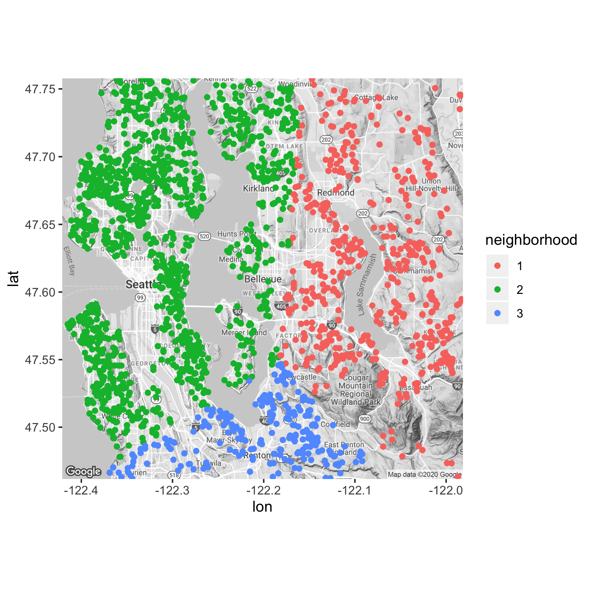
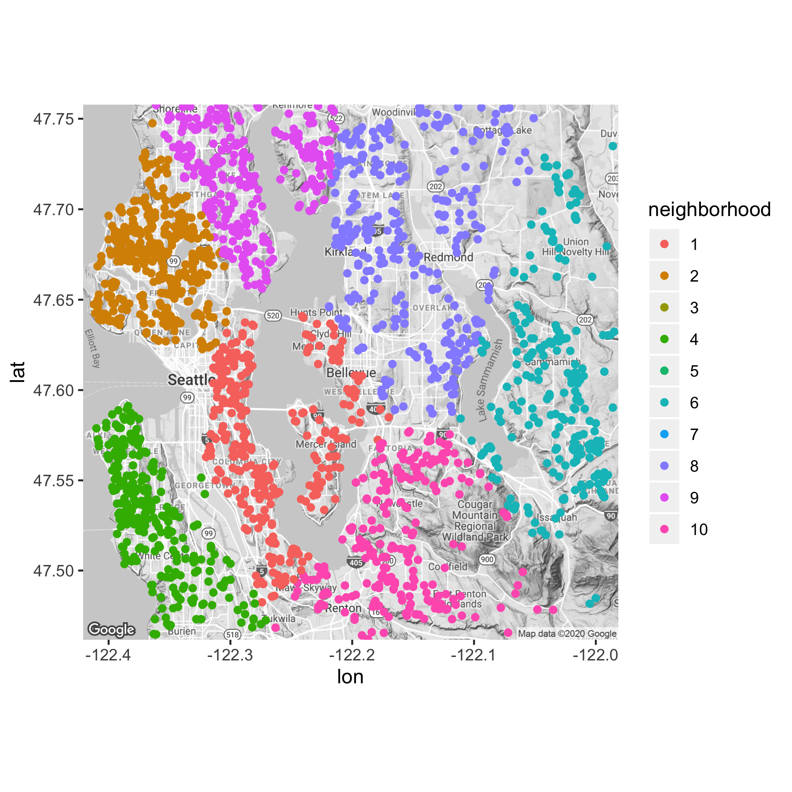
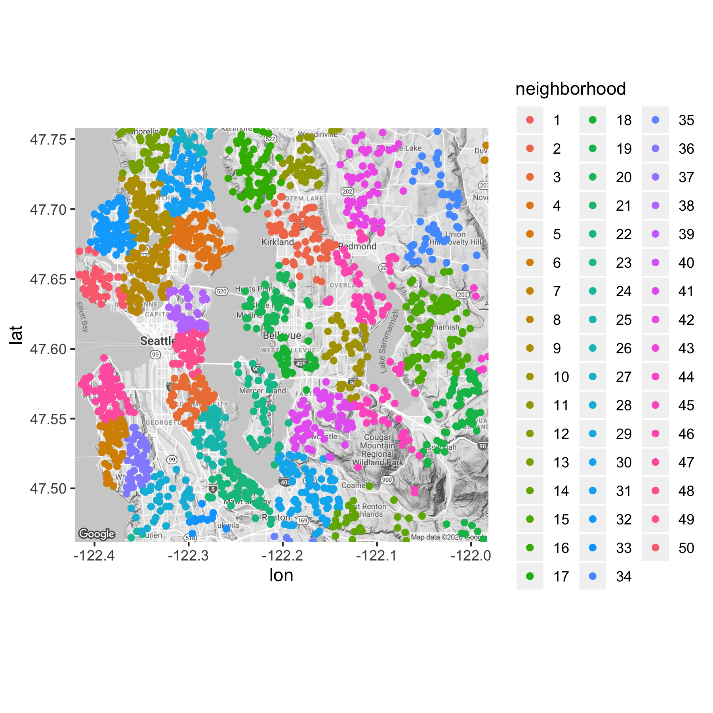

```{r setup, include=FALSE}
knitr::opts_chunk$set(echo = TRUE)
```

This script generates 

# Data import and cleaning

```{r}
#import data
library(dplyr)
library(car)
library(ggmap)
library(glmnet)
library(gridExtra)
library(car)
library("leaps")
google_key = as.character(read.delim("my_key.txt", header = FALSE)[1,])
rm(list=ls())
kc = read.csv("kc_house_data.csv")

#transforms
kc$id = NULL
kc$date = NULL
#hist(kc$price)
#hist(log(kc$price)) #we definitely want to regress on log price
kc$logprice = log(kc$price)
#sum(kc$sqft_living - (kc$sqft_above + kc$sqft_basement)) #these vars are perfectly collinear
kc$sqft_living = NULL #so I drop the sum
kc$zipcode = as.factor(kc$zipcode)

#cleaning up outlying points
#lm = lm(logprice ~ .-price-lat-long, data = kc)
#plot(lm, 4)
#plot(lm, 5)
#kc[15871,] #probably a typo - this should be 3 bedrooms, not 33
kc[15871,"bedrooms"] = 3
#kc["12778",] #a really expensive horse farm - going to drop
#kc["7648",] #a crazy large lot -- may be true but let's drop
#kc["17320",] #again, very large lot for a cheap price - drop
kc = kc[!rownames(kc) %in% c("12778","7648","17320"), ]
```

# Naive OLS Model

## Helper Function

```{r}
#split data into 10 folds
kc  = kc[sample(nrow(kc)),]
folds = cut(seq(1,nrow(kc)),breaks=10,labels=FALSE)

#helper function returns test RMSEs and in-sample R2s for the 10 splits, along with the last lm
runOLS = function(vars) {
  formula = as.formula(paste("logprice ~ ",vars,sep = ""))
  rmses = NULL
  r2s = NULL
  lm = NULL
  for(i in 1:10){
      #i = 3
      testIndexes <- which(folds==i,arr.ind=TRUE)
      test = kc[testIndexes, ]
      train = kc[-testIndexes, ]
      lm = lm(formula, data = train)
      test_pred = predict(lm, newdata = test)
      mse = sum((exp(test_pred) - exp(test$logprice))^2)/length(test_pred)
      rmse = sqrt(mse)
      #plot(lm,5)
      rmses[i] = rmse
      r2s[i] = summary(lm)$r.squared
  }
  return(list(rmses,r2s,lm))
}
```

## Results

Let's see how we did!

```{r}
results = runOLS(".-price-lat-long")
paste0("Test RMSE: $",mean(results[[1]]))
paste0("Training R-squared: ",mean(results[[2]]))
```

This test RMSE (about \$152,000) is our threshold to beat!  I'm also going to add these results to a dataframe to keep track of the performance of all of our models.

```{r}
model_performance = data.frame("model" = rep("naive model",10), "geo" = rep("zipcode",10), "rmse" = results[[1]], "r2" = results[[2]])
```

# Feature Engineering

## Polynomials & Interaction Terms

Let's start by creating a bunch of polynomial variables and interaction effects to capture possible nonlinear relationships and joint effects. Not all of these will be useful predictors -- we'll use the Regsubsets and LASSO approaches later to reduce our model specification.

```{r}
kc$bedrooms_2 = kc$bedrooms^2
kc$bedrooms_3 = kc$bedrooms^3
kc$bathrooms_2 = kc$bathrooms^2
kc$bathrooms_3 = kc$bathrooms^3
kc$bed.bath = kc$bedrooms * kc$bathrooms
kc$floors_2 = kc$floors^2
kc$floors_3 = kc$floors^3

kc$sqft_lot_2 = kc$sqft_lot^2
kc$sqft_lot_3 = kc$sqft_lot^3
kc$sqft_above_2 = kc$sqft_above^2
kc$sqft_above_3 = kc$sqft_above^3
kc$sqft_basement_2 = kc$sqft_basement^2
kc$sqft_basement_3 = kc$sqft_basement^3

kc$basement = replace(kc$sqft_basement, kc$sqft_basement>0, 1)
kc$view.waterfront = kc$waterfront * kc$view
kc$view_2 =  kc$view^2
kc$condition_2 =  kc$condition^2
kc$grade_2 = kc$grade^2

kc$age = 2015 - kc$yr_built
kc$condition.age = kc$condition * kc$age
kc$grade.age = kc$grade * kc$age
kc$age_2 = kc$age^2
kc$age_3 = kc$age^3
kc$age_since_ren_or_build = 2015 - pmax(kc$yr_built,kc$yr_renovated)
kc$age_since_ren_or_build_2 = kc$age_since_ren_or_build^2
kc$renovated = replace(kc$yr_renovated, kc$yr_renovated>0, 1)
kc$renovated.age2 = kc$renovated * kc$age^2
```

We're not going to use $sqft\_living15$ and $sqft\_lot15$ since our users probably don't have these neighborhood averages on hand. I'm also dropping $yr_built$ and $yr_renovated$ since we've converted those into more meaningful variables. 

```{r}
kc$sqft_living15 = NULL
kc$sqft_lot15 = NULL
kc$yr_built = NULL
kc$yr_renovated = NULL
```

Since we've changed our data pretty substantially, we check once more for outliers

```{r}
lm = lm(logprice ~ .-price-lat-long, data = kc)
plot(lm, 4) #there are some pretty dangerous outliers
#kc["1720",]
#kc["8093",]
#kc["7770",]
#kc["8758",]
kc = kc[!rownames(kc) %in% c("1720","8093","7770","8758"), ] #that I remove

#meaning we need to recalculate folds
kc  = kc[sample(nrow(kc)),]
folds = cut(seq(1,nrow(kc)),breaks=10,labels=FALSE)
```

### Results

```{r}
results = runOLS(".-price-lat-long")
model_performance = rbind(model_performance, data.frame("model" = rep("polynomial model",10), "geo" = rep("zipcode",10), "rmse" = results[[1]], "r2" = results[[2]]))

p1 = ggplot(model_performance, aes(x=model, y=rmse)) +
  geom_boxplot() 
p2 = ggplot(model_performance, aes(x=model, y=r2)) +
  geom_boxplot()
grid.arrange(p1, p2, ncol=2)
```

These transformations have substantially reduced our test error and improved our in-sample $R^2$.

## Location
Our dataset has two variables to describe a home's location: $zipcode$ and $lat/long$. In the naive model used above, we regressed on zipcode as a factor. But zipcode draws arbitrary boundaries that don't necessarily reflect real-world neighborhoods.

### K-means Clustering

An alternative approach is to use k-nearest neighbors to group the observations by geographic proximity using their latitudes and longitudes. Here, I use euclidian distance to measure the distance between two points -- while haversine distance would technically be more accurate, the two measures are basically the same given our regional scale. To find the optimal number of neighborhoods, I search a grid between 3 and 500 and evaluate the model's test set performance.

```{r}
bootstrap_results = NULL
for (j in c(1:10)) {
  train_index = sort(sample(seq_len(nrow(kc)), replace = FALSE, size = floor(nrow(kc)*.8)))
  grid = c(3,5,10,15,20,30,40,50,75,100,200)
  grid = data.frame("k" = grid, "rmse" = rep(NA, length(grid)))
  for (i in 1:nrow(grid)) {
    km = kmeans(kc[c("lat","long")],grid[i,"k"])
    kc$neighborhood = as.factor(km$cluster)

    lm = lm(logprice ~ .-price-zipcode-lat-long, data = kc[train_index,])
    test_pred = predict(lm, newdata = kc[-train_index,])
    mse = sum((exp(test_pred) - exp(kc[-train_index,"logprice"]))^2)/length(test_pred)
    rmse = sqrt(mse)
    grid[i,"rmse"] = rmse
  }
  bootstrap_results = rbind(bootstrap_results,grid)
}
```





For illustration, we can see what three different levels of granularity looks like: 3 neighborhoods, 10, and 100.

```{r}
bootstrap_results$k_fac = as.factor(bootstrap_results$k)
ggplot(bootstrap_results, aes(x=k, y=rmse,group=k_fac))+
  geom_boxplot(outlier.shape = NA) +
  scale_y_continuous(limits = quantile(bootstrap_results$rmse, c(0.1, 0.8)))
```

As we increase the number of neighborhoods from 1, I'd expect the prediction error to first fall (as we reduce bias) and then rise (as we introduce variance by overfitting). However, the prediction error falls throughout the range of values we've tested. Very high numbers of neighborhoods probably does create overfit (20,000 neighborhoods, for example, would fit every observation about perfectly). 

### Neighborhood Clusters vs. Postal Codes
Is clustering based on lat / long more effective than using the postal code variable? 

```{r}
kc$neighborhood = NULL
results = runOLS(".-price-lat-long")
results.zipcode = results[[1]]

km = kmeans(kc[c("lat","long")],70)
kc$neighborhood = as.factor(km$cluster)
results = runOLS(".-price-lat-long-zipcode")
results.neighborhood = results[[1]]

comparison = data.frame("model" = c(rep("70 zipcodes",10),rep("70 neighborhoods",10)), rmse = c(results.zipcode, results.neighborhood))

ggplot(comparison, aes(x=model, y=rmse)) +
  geom_boxplot() 
```

Our model seems to perform equally well whether we use 70 postal codes or 70 neighborhoods.  What if we use a much more granular neighborhood measure in conjunction with postal code?

```{r}
kc$neighborhood = NULL
results = runOLS(".-price-lat-long")
results.zipcode = results[[1]]

km = kmeans(kc[c("lat","long")],210)
kc$neighborhood = as.factor(km$cluster)
results = runOLS(".-price-lat-long-zipcode")
results.neighborhood = results[[1]]

results = runOLS(".-price-lat-long")
results.neighborhood.zip = results[[1]]

comparison = data.frame("model" = c(rep("(1) 70 zipcodes",10),rep("(2) 210 neighborhoods",10), rep("(3) 210 neighborhoods and 70 zipcodes",10)), rmse = c(results.zipcode, results.neighborhood,results.neighborhood.zip))

ggplot(comparison, aes(x=model, y=rmse)) +
  geom_boxplot() 
```

I'm going to keep the most complex model in this case. 

## OLS Assumptions

Are residuals normally distributed?

```{r}
lm = lm(logprice ~ .-lat-long-price, data = kc)
hist(lm$residuals, breaks = 100)
qqPlot(lm)
```

homoskedastic?

```{r}
plot(lm$fitted.values, lm$residuals,
     xlab = "Fitted values (y-hat)", 
     ylab = "Residuals")
```

Collinearity?

```{r}
#vif(lm)
```

# Variable Selection & Regularization

## Most important variables

```{r}
regfit.full=regsubsets(logprice ~ .-price-lat-long,kc, method = "forward", nvmax = 20)
for (i in c(1:5)) {
  print(coef(regfit.full ,i))
}
```

The five variables with the most predictive power are:

1. $grade$
2. $age^2$ (the positive coefficient implyies that new and old homes worth more)
3. $bathrooms$
4. $zipcode 98004$ (bellevue)
5. $view$

```{r}
for (i in c(1:20)) {
  i = 10
  best_vars = names(coef(regfit.full ,i))[-1]
  formula = paste0(best_vars, sep="+", collapse = "")
  formula = substr(formula,1,nchar(formula)-1)
  formula = paste0("logprice ~ .-lat-long-price+",formula,sep="")
  lm(formula, data = kc)
  
  //
}
```

## Lasso

To build our final model, I use LASSO to see if we can get any improvement in our test MSE through regularization.

```{r}
x = model.matrix(logprice ~ .-price-lat-long, data = kc)[,-1]
y = kc$logprice

train_index = sort(sample(seq_len(nrow(kc)), replace = FALSE, size = floor(nrow(kc)*.8)))
lasso_model = glmnet(x[train_index,],y[train_index],alpha=1) #performs normalization by default
plot(lasso_model, label = TRUE)

#what's in a large model?
lasso_model$lambda[50]
lasso.coef = coef(lasso_model)[,50]
lasso.coef[lasso.coef!=0]

#whats in a sparse model?
lasso_model$lambda[13]
lasso.coef = coef(lasso_model)[,13]
lasso.coef[lasso.coef!=0]

#use CV to find the optimal lambda
cv.out=cv.glmnet(x[train_index,],y[train_index],alpha=1)
bestlam=cv.out$lambda.min
plot(cv.out)

#estimate the out-of-sample RMSE
lasso.pred=predict(lasso_model,s=bestlam ,newx=x[-train_index,])
rmse = sqrt(sum(
  (exp(lasso.pred) - exp(y[-train_index]))^2
  )/length(lasso.pred))
```
Regularizing OLS isn't necessary here.

# Final Model

Lastly, we re-run our model on the full dataset and save it for export.

```{r}
lm = lm(logprice ~ .-price-lat-long, data = kc)
saveRDS(kc,file="kingcounty.rds")
saveRDS(lm,file="lm.rds")
```


```{r}
    ggplot(kc,aes(x=price)) +
      geom_density(aes(fill = "#00AFBB"), alpha = .9) +
      geom_density(data = subset(kc,zipcode == 98005), aes(fill = "#E7B800"), alpha = .7) +
      xlim(1,2000000) +
      scale_fill_identity(name = NULL, guide = "legend", labels = c("King County","Your Neighborhood"))
```